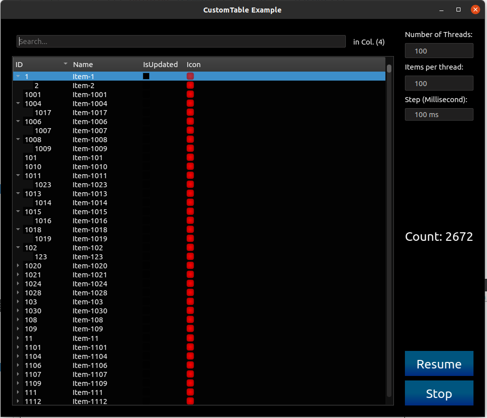

# Custom Table 
QWidget (Qt) based Table (also tree) Widget capable of showing items that created from multiple threads. Also has advanced filter widget. This repository also contains a sample project that shows how to use the module. This project located in **sample-project** folder.

  
  
 

## Table of contents
* [Dependencies](#dependencies)
* [How to use](#how-to-use)
* [Compile](#compile)


## Dependencies

 - Qt 5.9 or higher
 - CMake 3.10 or higher


## How to use
You can add this module to your project  as a sub-module (just custom-table folder) or library. follow steps bellow to add this table to your project :

### 1. Add CustomTable module to your project
you can add this module as a sub-module :

 - add custom-table folder to your project
 - add add_subdirectory to your cmake 
   
   Example :
   
   ```cmake
   add_subdirectory(custom-table)
   ```


Or add as a library :

 Example :
 ``` 
		include_directories(
		        ...
		     ${CMAKE_CURRENT_SOURCE_DIR}/custom-table/include/
		  )
		target_link_libraries(YourProjectName  PUBLIC
		      Qt5::Core
		      Qt5::Widgets
		      custom-table
		       ...
		  )
 ```


### 2. Inherit a class from "ITableItem" class

Objects created from this class will be corresponding with table rows. each Item provides data for one row. After creating your class, you need to implement the methods listed below: 

 - **getHeaders:** This method must return a list of strings that going to be shown as column headers in the table. 
    ```c++  
     const  QStringList  &getHeaders(quint32)  const  override;
   ```
   Example :
	```c++  
	const  QStringList&  SampleItem::getHeaders(quint32)  const
	{
	  QStringList  headers;
	  headers  <<  "ID"  <<  "Name";
	  return  headers;
	} 
	```

 - **updateFromSource:** In this method you need to create values for cells and set values to the base class by **setData** method.  you can use one **ITableItem** Objects to serve for multiple tables and show different values for different tables. The  **tableId** input defined the id of the table that these values were created for it. If you using just one table ignore this argument (set to 0 or 1).   
	```c++   
	  void  updateFromSource(quint32  tableId)override;
	  ```
	   
   Example For One table:
	```c++ 
	void  SampleItem::updateFromSource(quint32 tableId)
	{
	  QList<QVariant>  dt;

	  dt << QString::number(getId())
	     << _name
	     << _state
	     << _icon;
	  setData(tableId, dt);
	}
	```
	
	 Example For two table:
	```c++  
	void  SampleItem::updateFromSource(quint32 tableId)
	{
	  if (tableId == 0)
	  {
	    QList<QVariant>  dt;
	    dt << QString::number(getId())
	       << _name;
	    setData(tableId, dt);
	  }
	  else
	  {
	    QList<QVariant>  dt;
	    dt << QString::number(getOtherId())
	       << _otherName;
	    setData(tableId, dt);
	  }
	}
	```

### 3. Create and add Table to your UI
Just create an object from **ACustomTable** and add it to your UI. In **ACustomTable** constructor you need to add one object from your Inherited class so the table can be used to get headers and other things from it. 
If you want to have a filter and search widget for the table, you need to create   **ATableFilterWidget** object and add it to your UI as well.

The Manage Class to Add/Update/Delete Items is **ATableManager**. you can create it or just simply use the default manager by calling **getManager()** method.

Example:
```c++
#include "custom-table/ACustomTable.h"
#include "custom-table/ATableFilterWidget.h"
#include "custom-table/ATableManager.h"

void  MainWindow::initTable()
{
  auto  _tablePtr     = new ACustomTable(QSharedPointer<SampleItem>(new SampleItem()), 0);
  auto  _filterWidget = new ATableFilterWidget(_tablePtr);

  _tableManagerPtr = _tablePtr->getManager();

  _ui->widget->layout()->addWidget(_filterWidget);
  _ui->widget->layout()->addWidget(_tablePtr);
}
```


### 4.  Add/Update/Delete Items 
 **ATableManager** has some useful methods to get or set data to the table. In order To  Add, update or delete a row use **changeItem** slot. This slot can (should) be called from the thread by signal.
 ```c++
  void  changeItem(QSharedPointer<ITableItem>,  bool  isDeleted);
```
If the **id** of the item exists in the table, the manager class just updates the row, otherwise adds it as a new row to the table. also if  **isDeleted** is true the corresponding row will be deleted.

Adding new item example:
```c++
  auto  item  =QSharedPointer<SampleItem>(new  SampleItem());
  item->setId(1);
  item->setName("Item1");
  item->updateFromSource(0);
  _manager->changeItem(item);
```

Updating example:
```c++
  item->setId(1);
  item->setName("Item1-updated");
  item->updateFromSource(0);
  _manager->changeItem(item);
```

Deleting item example:
```c++
  item->setId(1);
  _manager->changeItem(item,true);
```


## Compile
```bash
  cd <Project Main folder>
  mkdir build
  cd build
  cmake ..
  make 
```

